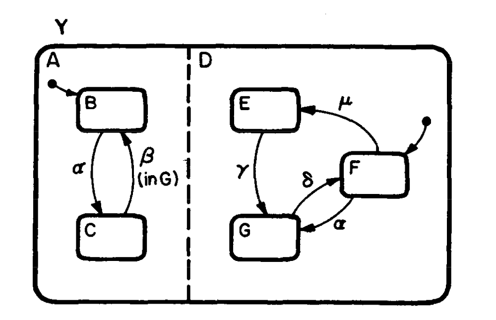
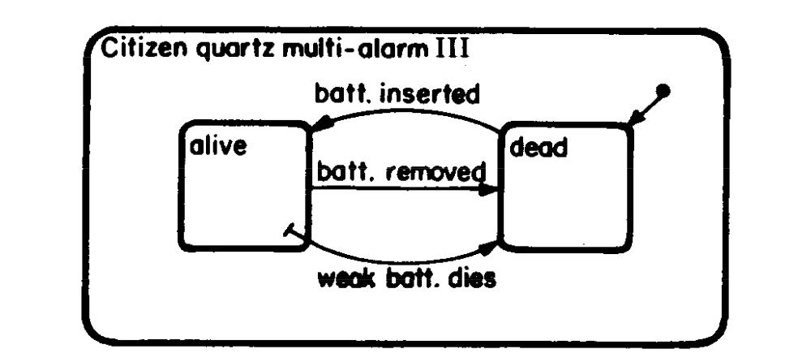
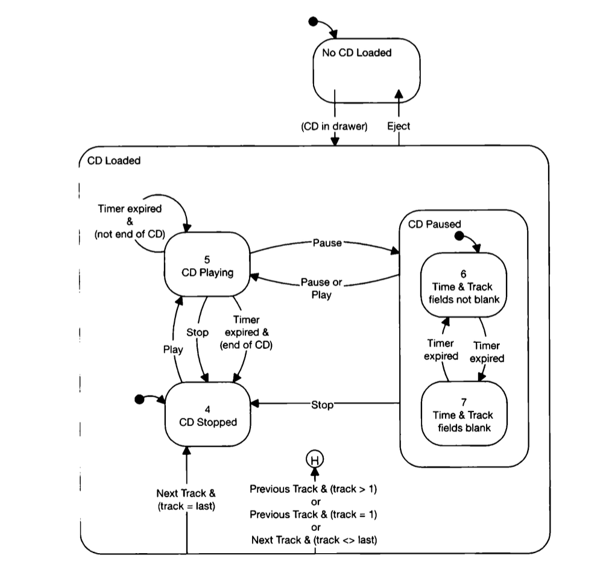

状态机和可视化图表是组织和传达信息的强大方式。所有那些可爱的“框和箭头”传达了有意义的关系，指示了顺序，并以更容易理解的方式引导流程，因为它是可视化的。再加上能够[将资产附加到你的图表](https://stately.ai/docs/assets)，你就可以创建真正富有表现力的、可执行的软件图表了。但状态机还有一个使其易于理解的特点。文本。

{/* truncate */}

当我说文本时，我主要指的是**名称**。状态、事件、参与者、动作和守卫都有名称。这些名称很重要，因为它们包含在可执行代码或其他[从 Studio 导出的格式](https://stately.ai/docs/export-as-code)中，所以它们不能是任意的或仅仅是装饰性的。用户经常向我们询问 [XState](https://stately.ai/docs/xstate) 中的命名约定以及如何命名他们状态机的各个部分。

我们可以将这些问题分为两类：

1. [我应该如何命名这个东西](#what-or-how-should-i-name-this-thing)？
2. [这个名字应该是什么风格](#what-style-should-that-name-be-in)？

<EmbedMachine
  name="一个状态机，展示了使用标题大小写命名状态、使用点大小写命名事件、使用驼峰命名法命名动作和参与者以及使用小写命名守卫的命名约定。"
  embedURL="https://stately.ai/registry/editor/embed/9fa24cc0-3026-41be-bb22-9afc3980fefc?machineId=db0e655e-f16f-4a30-97a7-a0081b73d532"
/>

## 我应该如何命名这个东西？

这个问题主要涉及语义，在这种情况下，这意味着状态机中使用的名称如何传达元素的目的和意义以及它们在状态机中的角色？状态应该命名为 **`Load`**、**`Loader`**、**`Loading`** 还是 **`Loaded`**？事件应该命名为 **`Submit`**、**`Submit form`**、**`Form submitted`**、**`On submit`** 还是 **`Form submission`**？确实有很多选择，没有一个绝对正确的答案。但有一些指南可以帮助你做出最佳选择。

**将词性映射到状态机**

一种思考状态机命名的有用方法是将其元素大致映射到各种词性。这可能是这样的：

1. **状态**：通常是名词或形容词
   - 状态表示不同的条件或模式。因此，它们通常用描述系统状态或质量的名词或形容词来命名。例如，**`idle`**、**`loading`**、**`authenticated`** 或 **`error`**。
2. **事件/转换**：通常是动词
   - 事件是触发状态转换的触发器。它们是动作或事件，因此最好用动词来命名。例如，**`submit`**、**`cancel`**、**`fail`**、**`load`**、**`sign in`** 或 **`clear form data`**。
3. **动作**：动词或动词短语
   - 动作是在响应事件或状态转换时执行的操作。它们应该是描述所采取动作的动词或动词短语。例如，**`sendRequest`**、**`displayError`**、**`updateData`**。
4. **守卫**：通常是形容词或过去分词
   - 守卫是决定是否应进行转换的条件检查。它们可以用描述满足条件的形容词或过去分词来命名。例如，**`isLoggedIn`**、**`hasValidData`**、**`isExpired`**。你会注意到这些与命名代码中的布尔变量的方式类似。
5. **父状态**：复合名词
   - 对于嵌套状态，这些也可以像常规状态一样是名词，或者它们可以是表示父状态的下级状态的形容词。例如，一个名为 **`Viewing Shopping Cart`** 的状态，其子状态为 **`Empty`** 和 **`Populated`**。
6. **调用的参与者**：名词或动名词
   - 当状态机调用服务（如 API 调用）时，这些通常用描述服务功能的名词或动名词（由动词派生并以 -ing 结尾的名词）来命名。例如 **`fetchingData`**、**`userAuthentication`**。

通过将状态机中的名称与这些词性对齐，状态机的结构和功能变得更加直观和易于理解，从而促进更好的沟通和文档编制。

### 简洁但具体

就像命名代码中的任何东西一样，选择简洁、不通用但包含足够信息以不含糊的名称是有帮助的。使名称“最小化地有意义”。

状态名称示例：

- **`Idle`** 而不是 **`State1`**
- **`Door Closed`** 而不是 **`Closed`**
- **`Payment Processing`** 而不是 **`State_Awaiting_Payment`**

事件名称示例：

- **`Submit`** 或 **`submit`** 而不是 **`Event1`**
- **`Receive payment`** 而不是 **`Event_Payment_Received`**

## 这个名字应该是什么风格？

当状态图首次在 [“Statecharts: A visual formalism for complex systems” (Harel, 1987)](https://www.inf.ed.ac.uk/teaching/courses/seoc/2005_2006/resources/statecharts.pdf) 中引入时，关于命名约定的讨论相对较少，许多图表使用字母和数字来表示状态和事件。状态图引入的创新集中在视觉上表示关系，以支持现实世界的软件用例，如层次结构、并行性、历史状态等。



该论文后面的某些示例确实展示了状态和事件标签的使用，但这些通常是单词或短语，没有注意风格。有趣的是，这个示例使用了 **`dot.case`** 风格的事件名称，你可以[跳到这里阅读](#xstate-v5-and-dotcase)。



到 1999 年出版的《Constructing the User Interface with Statecharts》一书时，更具描述性的状态和事件标签出现在用于建模硬件和软件系统的详细状态图示例中。这个 CD 播放器的示例（还记得那些吗？）相当详细，并且在使用名称和文本注释方面也非常清晰。你可以[查看受此示例启发的状态机](https://stately.ai/registry/editor/9fa24cc0-3026-41be-bb22-9afc3980fefc?machineId=5b186011-088e-4c1c-be95-9a489a126b13)或[查看完整示例](https://stately.ai/registry/editor/9fa24cc0-3026-41be-bb22-9afc3980fefc?machineId=24adba0d-a6ac-4e79-836c-e0d91bb7ab85)，借鉴自该书。



自从那些关于状态图的早期著作以来，几乎所有主要编程语言的出现都普及了许多代码命名约定。以下是一些你可以在 XState 中为状态、事件、动作和守卫命名时选择的最常见风格：

- **`Title Case`**
- **`Sentence case`**
- **`lower case`**
- **`UPPER CASE`**
- **`PascalCase`**
- **`camelCase`**
- **`snake_case`**
- **`kebab-case`**

当 XState 于 2016 年发布时，许多早期示例展示了使用 **`UPPER_CASE`** 命名事件名称（这在 Redux 动作类型中也很流行）和 **`camelCase`** 命名几乎所有其他内容，如状态、动作、守卫等。但 [XState](https://stately.ai/docs/xstate) 不强制执行任何特定约定，取决于你和你的团队决定什么最适合你们。像 **`Title Case`**、**`Sentence case`** 和 **`lower case`** 这样的空格分隔风格是有效的选项，你可以将它们用引号括起来作为 JavaScript 或 TypeScript XState 对象键使用。[Stately Studio 将导出代码](https://stately.ai/docs/export-as-code)时也会用引号括起你的名称。

### XState v5 和 `dot.case`

快进到 2024 年，随着 [XState v5 的最新发布](https://stately.ai/blog/2023-12-01-xstate-v5)，强烈推荐一种特定的事件名称风格，那就是 **`dot.case`**。如果你还记得上面 Quartz 手表的图片，有类似 **`battery.inserted`**、**`battery.removed`** 和 **`weak battery.dies`** 的事件名称。这种风格允许在 XState v5 中使用一种新功能，称为通配符转换。例如，如果你有一个名为 `logBatteryStatus` 的动作，你可以用任何匹配 **`battery.*`** 的事件注册该动作，一个通配符转换：

```typescript
states: {
  Running: {
    on: {
      'battery.*': {
        actions: 'logBatteryStatus',
      },
    },
  }
}
```

我个人喜欢这种事件命名约定，因为它在视觉上将事件与状态机中的其他名称区分开来，并且其缺乏大量大写使其看起来更 **`streamlined.for.action`**，就像事件应该的那样！

:::warning

与事件名称不同，目前无法在命名状态或机器时包含 `.`。请不要这样做。

:::

## 其他提示

以下是一些额外的考虑因素，可以在选择 XState 的命名风格时考虑，以使你的状态机更具可读性和易于理解。

### 提高可读性

我最喜欢的状态机命名提示之一是使用对比风格。对比是我们喜欢的许多事物的关键成分，从食物到颜色、艺术和音乐。状态机的可读性也可以从对比中受益。如果你使用 **`SHOUTY_UPPERCASE`** 事件名称，请不要在同一机器中也使用这种大小写来命名状态或其他任何东西。同时，不要只是用 **`plain old lower case`** 命名每个状态、事件和动作，除非你希望你的状态机读起来像一个无聊的青少年带着“声带疲劳”。区分可以帮助读者区分状态机的某些元素，这适用于编辑器画布上的可读性以及代码中的可读性。

### 了解你的受众

Stately Studio 能够将这些可执行图表转换为代码确实很强大，但如果你的大部分目标受众技术水平较低，并且将在 Studio 中查看你的状态机呢？某些观众可能更习惯于阅读某些命名风格，例如 **`Sentence case`** 而不是 **`snake_case`**。使用 [Studio Pro Plan](https://stately.ai/docs/studio-pro-plan) 的用户可以利用 [版本历史](https://stately.ai/docs/versions) 创建不同风格的相同状态机版本，并通过[共享特定机器版本的 URL](https://stately.ai/docs/url#copy-the-url-from-the-browser-address-bar)或[导出为 markdown、故事、测试等](https://stately.ai/docs/export-as-code)与不同的受众共享。

### 一致性是关键

选择你想要的任何东西，但尽量保持一致。读者希望理解你选择的命名约定，并依赖它。如果你将状态命名为 **`Waiting`**、**`Downloading`**、**`Synchronizing`**，那么当他们看到另一个以 **`ing`** 结尾的单词时，他们可能会认为它也是一个状态，而不是一个事件。同样，如果你使用 **`camelCase`** 命名动作，你可能会考虑以这种方式命名所有动作，无论它们是状态上的进入/退出动作还是转换上的动作。所以请记住，一致性在这里是关键。

### 约定和维护

从一致性中，通常会出现约定。这些约定可以在整个状态机、整个项目或特定用户或团队的所有项目中遵循。这使得工作更容易理解和维护，从而促进协作。

### 总结

命名约定和命名风格是品味问题，但也是个性化和定制的机会，无论是个人还是团队层面。最重要的是可读性、一致性和使用命名来传达意义。

<EmbedMachine
  name="一个 CD 播放器示例的一部分状态机，显示 CD 加载、停止、播放和暂停的状态。"
  embedURL="https://stately.ai/studio/editor/embed/9fa24cc0-3026-41be-bb22-9afc3980fefc?mode=design&machineId=5b186011-088e-4c1c-be95-9a489a126b13"
/>

有时关注细节可以大大确保机器不仅看起来不错，而且尽可能易于理解。记住，当你的状态机看起来不错时，你也看起来不错！