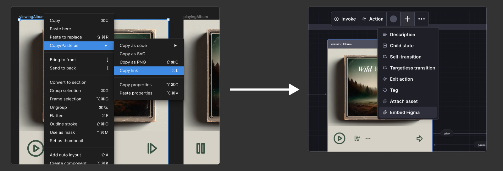

我们已经通过几个重大更新开启了 2024 年的 Stately，例如[检查实时 XState 代码](/blog/2024-01-15-stately-inspector)、[与 GitHub 同步](/blog/2024-01-09-introducing-bidirectional-github-sync)和[在 Studio 中为动作和演员编写代码](/blog/2024-01-09-introducing-sources)。

今天我们很高兴地宣布，我们还推出了与 Figma 的集成！
你现在可以将 Figma 框架附加到 Stately 的状态中。
{/* truncate */}

  <ThemedImage
    alt="三个 Figma 框架显示在音乐播放器的三个 Stately 状态中。ready 状态显示唱片堆叠应用视图，following the openAlbum 事件，viewingAlbum 状态显示 Wild Winds 专辑封面和信息，从 viewingAlbum 状态，有一个 play 事件将你带到 playingAlbum 状态，该状态显示 Wild Winds 专辑的专辑列表和播放器进度条。pause 事件从 playingAlbum 状态返回到 viewingAlbum 状态。"
    sources={{
      light: '/xstate-zh/blog/2024-01-24-embed-figma/figma-light.png',
      dark: '/xstate-zh/blog/2024-01-24-embed-figma/figma-dark.png',
    }}
  />

## 通过结合 Stately 和 Figma 改善团队工作流程

将 Figma 嵌入 Stately 可以显著简化和增强团队的工作流程。

能够查看你正在讨论的状态的模型，使得很容易_看到_可能缺少的内容并识别潜在的改进。它允许团队成员直接将设计视为应用逻辑的一部分。

以下是两个示例：

- 工程师可以导入状态机代码，然后设计师可以为代码中的每个实际逻辑状态填充图像。

- 设计师、产品经理和其他利益相关者可以通过将 Figma 框架嵌入 Stately 图表来创建预期行为，然后工程师可以继续从自动生成的代码中添加功能。

这种无缝集成可以加快设计过程，并确保所有团队成员都在同一页面上。团队成员可以轻松分享设计细节，进行评审，并与不同专业的人一起迭代。

它还确保每个人始终查看最新的设计，因为在 Figma 中所做的更改会反映在嵌入视图中。并且启用[GitHub 同步](blog/2024-01-09-introducing-bidirectional-github-sync)后，对代码的更改甚至可以自动更新 Figma 框架在 Stately 中的组织方式。

## 如何嵌入 Figma 框架

Figma 嵌入是我们[专业计划](/docs/studio-pro-plan)的一部分。你可以[通过我们的免费试用体验所有高级功能](https://stately.ai/pricing)。

要在 Stately 中嵌入 Figma 框架，首先你需要使用个人访问令牌进行身份验证。

1. 从 Figma 获取[个人访问令牌](https://help.figma.com/hc/en-us/articles/8085703771159-Manage-personal-access-tokens)。将“文件内容”设置为“允许只读访问”，以便 Stately 可以获取图像。
2. 在 Stately 中输入此令牌，打开一个项目，找到左上角的 **Stately 菜单**，选择 **账户**，打开 **设置**，然后点击 **Figma** 选项卡。

然后你可以将框架链接到状态。

3. 在 Figma 中，右键点击你想要嵌入的框架，选择 **复制/粘贴为**，然后选择 **复制链接**。
4. 在 Stately 中，选择一个状态，打开 **+** 菜单，选择 **嵌入 Figma**，然后粘贴你的链接。

[观看我们最近的 Office Hours 中嵌入 Figma 框架的工作视频](https://www.youtube.com/live/c05bOPeinSA?si=qyUlnx7f7_StLDZ_&t=1006)。

现在，Figma 中对该框架的任何更改将在每次页面加载后自动反映在 Stately 中。

你可以通过选择状态并在嵌入图像的右上角找到控件来删除嵌入或调整图像大小。

一些更多的细节以帮助你开始：

- Stately 支持链接到你可以获取的任何类型的 Figma 节点，而不仅仅是框架。但我们通常推荐使用框架，因为它们与状态的对应关系很好。
- Figma 嵌入是 Stately 中的一种新型**资产**。我们还支持[将图像、视频、文档和 PDF 附加到状态作为资产](/docs/assets)。你可以一次在画布上展示一个资产。要展示不同的资产，请打开状态详细信息面板并将该资产拖到资产列表的第一个位置。
- Stately 将 Figma 框架嵌入为 SVG 图像。这意味着快速加载时间和在不同尺寸下的出色缩放质量。然而，Figma 的一些功能（如背景模糊）在 svg 导出中不受支持。当你注意到问题并且高视觉保真度很重要时，你可以将框架导出为 PNG 图像，然后将图像本身作为图像资产附加到 Stately 状态（而不是作为链接的 Figma 嵌入）。它只是不会自动同步。

## 试试看！

我们很高兴看到你如何使用这个功能。它有很大的潜力来减少角色之间的隔阂并帮助使沟通更加顺畅。

请在我们的[社交平台](https://discord.stately.ai)或定期的[Office Hours 直播](https://www.youtube.com/watch?v=-Jf9N-EaUx0&list=PLvWgkXBB3dd6PXbSoctwDXjWX-AQrxhds)中与我们分享你的反馈。如果你想获得嵌入 Figma 框架或让你的团队设置 Stately 和 XState 的帮助，[Stately 团队提供研讨会和咨询服务](https://stately.ai/pricing#services)，你可以[预约演示电话](https://calendly.com/d/yc8-3hq-rpc/request-a-demo)了解更多关于 Stately 如何为你的团队工作的信息。