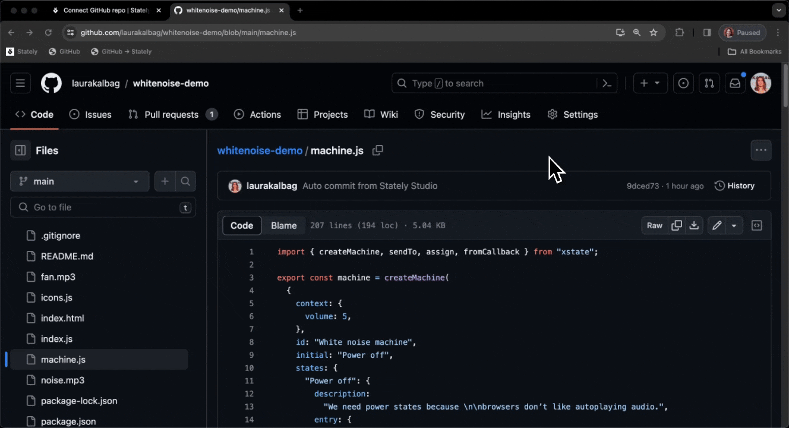

你在代码库中使用 XState，并且想要对状态机进行更改。你不想触碰任何代码，但希望将拉取请求提交回 GitHub。我们的单文件导入功能让你可以在浏览器中完成所有操作。

{/* truncate */}

去年这个时候，[我们介绍了从 GitHub 导入单个文件到 Stately Studio](/blog/2023-02-06-github-import-machines)。现在，我们更进一步。作为我们[双向 GitHub 集成](/blog/2024-01-09-introducing-bidirectional-github-sync)的一部分，你可以从 GitHub 中的单个文件导入状态机（或多个状态机！），在 Stately Studio 中进行更改，并在不触碰任何代码的情况下将拉取请求提交回 GitHub。你可以在浏览器中完成所有操作；无需代码编辑器。

## 快速可视化来自 GitHub 的任何状态机



要将任何状态机从 GitHub 导入到 Stately Studio，只需将 URL 中的 `.com` 部分更改为 `.stately.ai`。例如，`https://github.com/username/repo/blob/main/apps/superMachine.ts`，变为
`https://github.stately.ai/username/repo/blob/main/apps/superMachine.ts`。按下回车键，你将被带到 Stately Studio，机器将被可视化并准备好进行编辑。

或者，为了更快地访问，请使用我们的书签小工具。只需将以下书签链接拖到你的书签栏：

<p>
<a style={{border: '1px solid', borderRadius: '1rem', padding: '0.5rem 0.75rem'}} href="javascript:(function()%7Bjavascript%3A(function()%7B%20location.href%20%3D%20'https%3A%2F%2Fgithub.stately.ai%2F'%20%2B%20window.location.pathname%3B%7D)()%3B%7D)()%3B">GitHub → Stately</a>
</p>

或者手动添加书签：

1. 添加一个新的书签到你的浏览器。
2. 将书签的网络地址设置为以下内容：
    ```javascript:(function(){ location.href = 'https://github.stately.ai/' + window.location.pathname;})();```
3. 在查看包含一个或多个机器的 GitHub 文件时，点击书签小工具，将该机器导入到 Stately Studio。

你只需要一个[GitHub 个人访问令牌](/docs/import-from-github/#github-personal-access-token)和一个[Stately Pro 账户，你可以试用免费试用版](https://stately.ai/pricing)。

## 在 Stately Studio 内部创建 GitHub 拉取请求

一旦你的机器在 Stately Studio 中，你可以进行更改。当你准备好将拉取请求提交回 GitHub 时，使用顶部栏中的**创建拉取请求**按钮。我们是 Stately 的开发人员，所以我们知道如果你不知道代码的样子，你不一定想创建拉取请求，因此在创建拉取请求之前，你可以看到在 Stately Studio 中所做更改的代码差异。

<p>
  <ThemedImage
    alt="Stately Studio 中的拉取请求模态窗口，显示红色删除的代码行和绿色插入的代码行。"
    sources={{
      light: '/xstate-zh/blog/2024-02-07-single-file-prs/diff.png',
      dark: '/xstate-zh/blog/2024-02-07-single-file-prs/diff-dm.png',
    }}
  />
</p>

我们的 GitHub 集成是 Stately Studio 的高级功能。你可以通过免费试用来试用我们的高级计划。[今天注册](https://stately.ai)或[查看我们的 Pro 计划](/docs/studio-pro-plan)、[团队计划](/docs/studio-team-plan)和[企业计划](/docs/studio-enterprise-plan)功能。