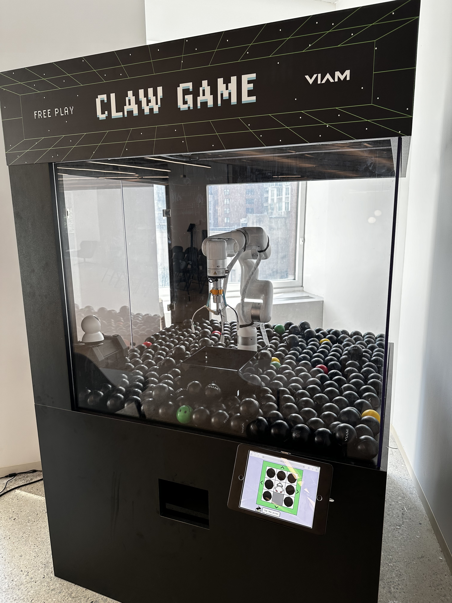
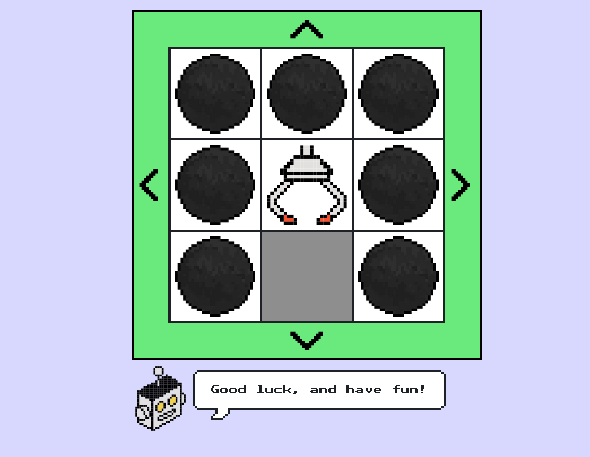

“机器人”一词引发了各种各样的想法，从手动控制的机器到自动化的软件爬虫。在这个领域的一个主要例子是机器人手臂，传统上用于帮助和扩展人类在制造、手术和太空探索中的能力。这些用例中的每一个都需要某种方式来编程和控制手臂以执行其专用任务，通常使用由制造商开发的专有软件。用户界面通过触摸屏设备或物理连接到手臂的桌面应用程序与硬件紧密耦合，这使得它难以安全地在线使用现代技术。

[Viam](https://www.viam.com/) 提供了一个开源软件栈和一套云服务，使得没有任何硬件经验的开发人员也能管理各种类型的机器人（和其他智能机器）。为了帮助展示可以使用 Viam 构建的体验类型，开发者宣传团队[构建了一个街机抓娃娃游戏](https://docs.viam.com/tutorials/projects/claw-game/)，该游戏使用了一个工业机器人手臂和一个街机抓手，可以通过[TypeScript SDK](https://ts.viam.dev/)驱动的单页 Web 应用程序进行操作。

{/* truncate */}



即使是一个相对受限的体验，管理操作手臂的各种可能动作和状态也使得维护 Web 应用程序的代码变得相当困难，尤其是对于那些想要更新某些功能的人来说。处理与手臂移动时可能碰撞的障碍物相关的任何错误，以及防止在手臂正在移动或抓取时发送命令，这一点非常重要。此外，作为一个开源示例，我们希望代码能够被学习 Viam 的开发人员理解，而不会迷失在特定于用户界面的逻辑中。

鉴于这一任务和我过去使用 XState 的经验，我选择了 Stately Studio 和 XState 将抓娃娃游戏 Web 应用程序变成一个更接近生产环境的系统！

## 理解问题



如前所述，Web 应用程序实际上是一个单页体验。它是一组静态资产（`index.html`、`styles.css`、`main.ts`），由运行在嵌入式 Linux 设备（在本例中为 [NVIDIA Jetson Orin Nano](https://docs.viam.com/get-started/prepare/jetson-nano-setup/)）上的静态文件服务器编译和提供，其中也运行着 [viam-server 机器人开发工具包](https://docs.viam.com/get-started/installation/)。这纯粹是为了方便而不是必要，因为 Viam TypeScript SDK 使用 WebRTC 连接到 `viam-server`，因此该应用程序可以在世界上任何有互联网连接的设备上运行。

由于用户界面本身相当简单，没有使用客户端框架；只有 DOM API 和 Viam SDK。让我们看看项目中 `main.ts` 文件中的 `main` 函数，它汇集了大部分与用户界面和机器人交互的逻辑；我们可以开始识别有限状态和动作的机会：

```typescript
async function main() {
  // 连接到客户端
  let client: Client;
  try {
    client = await connect();
    console.log('已连接!');
  } catch (error) {
    console.log(error);
    return;
  }
  const motionClient = new MotionClient(client, motionClientName);
  const boardClient = new BoardClient(client, boardClientName);
  const armClient = new ArmClient(client, armClientName);
  const gripperClient = new GripperClient(client, gripperClientName);
  // 更多代码如下
```

一开始，有一些设置逻辑用于连接到机器人，如果机器离线，这些逻辑可能会失败，但没有太多的错误处理。从这个片段中，我至少可以识别出四种状态：`initializing`、`connectingToMachine`、`clientErrored` 和 `connected`。一旦主客户端连接到机器人，我们就会创建我们想要控制的每个组件客户端的实例。

```typescript
let isMoving = false;

function styleMove(state) {
  let element = document.getElementById('grid-container');
  if (state === 'move') {
    element.classList.remove('grid-container-error', 'grid-container-ready');
    element.classList.add('grid-container-moving');
  } else if (state === 'ready') {
    element.classList.remove('grid-container-error', 'grid-container-moving');
    element.classList.add('grid-container-ready');
  } else if (state === 'error') {
    element.classList.remove('grid-container-moving', 'grid-container-ready');
    element.classList.add('grid-container-error');
  }
}
```

现在我们可以看到一个有趣的布尔变量（`isMoving`）和显式状态的混合，它们被传递给一个函数，以样式化机器人手臂可以移动到的象限网格。这有助于提供一些额外的状态来建模：`ready`（这可以与`connected`状态分开）和`moving`。根据机器的当前状态更新样式可以作为机器配置中的副作用发生，也可以通过订阅机器状态来实现；我们可以在 Stately Studio 中建模时探索这一点。

```typescript
// 定义按钮行为的辅助函数
async function mouseDown(func: () => Promise<boolean>) {
  if (isMoving) return;
  styleMove('move');
  isMoving = true;
  let success = await func();
  if (success) {
    styleMove('ready');
    isMoving = false;
  }
}

function setButtonBehavior(
  button: HTMLTableCellElement,
  func: () => Promise<boolean>,
) {
  button.addEventListener('mousedown', () => {
    mouseDown(func);
  });
}

async function planarMoveHandler(
  button: HTMLTableCellElement,
  x: number,
  y: number,
) {
  try {
    await inPlaneMove(motionClient, armClient, x, y);
  } catch (error) {
    console.log(error);
    styleMove('error');
    setTimeout(() => {
      styleMove('ready');
      isMoving = false;
    }, moveTimeout);
    return false;
  }
  return true;
}

setButtonBehavior(forwardbutton, () =>
  planarMoveHandler(forwardbutton, -moveDistance, 0),
);
setButtonBehavior(backbutton, () =>
  planarMoveHandler(backbutton, moveDistance, 0),
);
setButtonBehavior(rightbutton, () =>
  planarMoveHandler(rightbutton, 0, moveDistance),
);
setButtonBehavior(leftbutton, () =>
  planarMoveHandler(leftbutton, 0, -moveDistance),
);
```

现在我们进入了真正的操作。`mouseDown`辅助函数在发送命令给机械臂时，做了几件事来协调用户界面：在机械臂移动时进行保护，在调用包装的异步命令之前更新样式和全局变量，检查命令的结果，如果成功则再次更新样式和全局变量。在`mouseDown`处理程序中没有错误处理，

```typescript
// Define buttons for movement between quadrants
async function moveHandler(func: Promise<void>) {
  try {
    await func;
  } catch (error) {
    console.log(error);
    styleMove('error');
    setTimeout(() => {
      styleMove('ready');
      isMoving = false;
    }, moveTimeout);
    return false;
  }
  return true;
}

setButtonBehavior(gridBackLeft, () =>
  moveHandler(moveToQuadrant(motionClient, armClient, -1, -1)),
);
setButtonBehavior(gridBack, () =>
  moveHandler(moveToQuadrant(motionClient, armClient, -1, 0)),
);
setButtonBehavior(gridBackRight, () =>
  moveHandler(moveToQuadrant(motionClient, armClient, -1, 1)),
);
setButtonBehavior(gridLeft, () =>
  moveHandler(moveToQuadrant(motionClient, armClient, 0, -1)),
);
setButtonBehavior(gridHome, () => moveHandler(home(motionClient, armClient)));
setButtonBehavior(gridRight, () =>
  moveHandler(moveToQuadrant(motionClient, armClient, 0, 1)),
);
setButtonBehavior(gridFrontLeft, () =>
  moveHandler(moveToQuadrant(motionClient, armClient, 1, -1)),
);
setButtonBehavior(gridFrontRight, () =>
  moveHandler(moveToQuadrant(motionClient, armClient, 1, 1)),
);
```

这与我们刚刚探索的 `inPlanarMove` 设置类似，因此已经有一些将这些工作结合到一个 `moveHandler` 中的潜力，但要注意混合副作用和状态变化的警告。当前的 `moveHandler` 很可能不包括 `moving` 样式更新和全局变量更改，因为 `moveToQuadrant` 使用了 [`armClient.isMoving()`](https://docs.viam.com/components/arm/#ismoving) 方法进行保护，但在不探索该函数的实现情况下，很难知道这一点。

```typescript
// 定义按钮以抓取和返回对象
async function dropHandler() {
  try {
    await zMove(motionClient, armClient, 240);
    await grab(boardClient, gripperClient);
    await delay(1000);
    await zMove(motionClient, armClient, moveHeight);
    await home(motionClient, armClient);
    await delay(1000);
    await release(boardClient, gripperClient);
  } catch (error) {
    console.log(error);
    styleMove('error');
    setTimeout(() => {
      styleMove('ready');
      isMoving = false;
    }, 2000);
    return false;
  }
  return true;
}

setButtonBehavior(dropbutton, () => dropHandler());
```

在最后的代码片段中，我们可以看到第三次迭代的通用移动处理程序编排，包含了更多的命令和异步行为。`dropHandler` 负责从游戏底部抓取一个球并将其移动到投放槽释放（如果它能够抓到一个球的话）。这与其他移动处理程序有着明显的不同，即使在错误处理逻辑上有重叠。

在完成对游戏代码的初步分析后，让我们尝试在 Stately Studio 中对其进行建模！

## 在 Stately Studio 中建模

完成的状态机：

<EmbedMachine
  name="A state machine demonstrating the logic for a robotic claw game that can move around and pick up balls."
  embedURL="https://stately.ai/registry/editor/embed/40eef216-51c5-4c58-aa9a-22b5ed25ee68?mode=design&machineId=72280163-4dde-4e85-a2a1-b30f49c7f27f"
/>

在我们深入研究 Stately 模型时，我将使用 MermaidJS 图表来聚焦某些部分并提供“增强”视图。



正如我们在首次探索主要 TypeScript 逻辑时提到的，我们有一个相当经典的 `initializing` 起始状态，在 `connect` 动作后转换到 `connectingToMachine` 状态。这使我们能够控制何时开始连接或在发生某些情况时尝试重新连接；我们也可以在未来将其称为 `disconnected` 以便更清晰。在 `connectingToMachine` 状态中，我们调用一个 `createRobotClient` actor，它复制 `connect` 辅助函数并在成功时将客户端分配给机器上下文。作为对原始逻辑的第一个改进，我们为该 actor 添加了一个显式错误处理程序，以转换到 `clientErrored` 状态，并允许重试操作转换回 `initializing`。`connected` 状态将在进入时将必要的组件客户端分配给机器上下文后立即转换到 `ready` 状态。



从 `ready` 状态开始，第一个要查看的动作是 `move`。这将转换到 `moving` 状态（不再需要更新单独的布尔变量 🎉），并调用带有一组输入参数的 `armMover` actor，以指定 `x` 和 `y` 参数以及移动类型：`planar` 或 `quadrant`；这允许合并工作流来处理这两种类似的交互。成功后，机器将立即转换回 `ready`。错误情况是我最喜欢的部分之一；除了显式的 `displayingMoveError` 状态外，我们还可以在一个地方看到设定时间后的自动转换。



最后一个动作看起来几乎与前一个动作相同：我们执行 `dropAndHome` 动作以转换到 `picking` 状态，并调用 `dropHandler` actor。我们没有将 `picking` 作为 `armMover` 输入中的一个选项，而是将这个更复杂的工作流分开，以便以后有机会进行优化。

即使在将生成的状态机配置包含到代码库之前，这种对机器控制逻辑的高级视图也是一个很棒的工具，可以包含在文档中，并教导团队的其他成员如何工作。

## 重构代码

为了启动这个状态机的实现，我从 Stately Studio 获取了 XState v5 生成的 TypeScript 代码，并将其添加到抓娃娃游戏应用的 `main.ts` 中，以开始填充动作和 actor。

```typescript
const clawMachine = setup({
  types: {
    context: {} as ClawMachineContext, // 抽象为显式类型以提高可读性
    events: {} as ClawMachineEvent, // 抽象为显式类型以提高可读性
  },
  actions: {
    assignClients: assign({
      motionClient: ({ context }, params: ClientNameParams) =>
        new MotionClient(context.machineClient, params.motionClientName),

      boardClient: ({ context }, params: ClientNameParams) =>
        new BoardClient(context.machineClient, params.boardClientName),

      armClient: ({ context }, params: ClientNameParams) =>
        new ArmClient(context.machineClient, params.armClientName),

      gripperClient: ({ context }, params: ClientNameParams) =>
        new GripperClient(context.machineClient, params.gripperClientName),
    }),
    assignError: assign({
      error: (_, params: { error: Error }) => params.error,
    }),
    assignRobotClient: assign({
      machineClient: (_, params: { client: Client }) => {
        return params.client;
      },
    }),
    clearError: assign({ error: null }),
    styleMove: (_, _params: { state: 'moving' | 'ready' | 'error' }) => {},
    logError: (_, params: { error: Error }) => {
      console.error(params.error);
    },
  },
  actors: {
    createRobotClient: fromPromise<
      Client,
      { apiKey: string; apiKeyId: string; locationAddress: string }
    >(async ({ input }) => {
      const credential = {
        type: 'api-key',
        payload: input.apiKey,
      };

           // 这是你的机器人主要部分的主机地址。
      const host = input.locationAddress;

      return createRobotClient({
        host,
        credential,
        authEntity: input.apiKeyId,
        signalingAddress: 'https://app.viam.com:443',
      });
    }),
    moveHandler: fromPromise<void, MoveInput>(async ({ input }) => {
      if (input.target == 'quadrant') {
        await moveToQuadrant(
          input.motionClient,
          input.armClient,
          input.x,
          input.y,
        );
      }
      if (input.target == 'planar') {
        await inPlaneMove(
          input.motionClient,
          input.armClient,
          input.x,
          input.y,
        );
      }
    }),
    dropHandler: fromPromise<void, ClawMachineContext & { moveHeight: number }>(
      async ({ input }) => {
        await zMove(input.motionClient, input.armClient, 240);
        await grab(input.boardClient, input.gripperClient);
        await delay(1000);
        await zMove(input.motionClient, input.armClient, input.moveHeight);
        await home(input.motionClient, input.armClient);
        await delay(1000);
        await release(input.boardClient, input.gripperClient);
      },
    ),
  },
}).createMachine({
  context: { error: null } as ClawMachineContext,
  id: 'Claw Machine',
  initial: 'initializing',
  states: {
    initializing: {
      on: {
        connect: {
          target: 'connectingToMachine',
        },
      },
    },
    connectingToMachine: {
      invoke: {
        id: 'clientConnection',
        input: {
          apiKey: robotAPIKey,
          apiKeyId: robotAPIKeyID,
          locationAddress: robotLocation,
        },
        onDone: {
          target: 'connected',
          actions: {
            type: 'assignRobotClient',
            params: ({ event }) => ({ client: event.output }),
          },
        },
        onError: {
          target: 'clientErrored',
          actions: [
            {
              type: 'assignError',
              params: ({ event }) => ({ error: event.error as Error }),
            },
            {
              type: 'logError',
              params: ({ event }) => ({ error: event.error as Error }),
            },
          ],
        },
        src: 'createRobotClient',
      },
    },
    connected: {
      always: {
        target: 'ready',
      },
      entry: {
        type: 'assignClients',
        params: {
          motionClientName,
          boardClientName,
          armClientName,
          gripperClientName,
        },
      },
    },
    clientErrored: {
      entry: { type: 'styleMove', params: { state: 'error' } },
      on: {
        retry: {
          target: 'initializing',
          actions: { type: 'clearError' },
        },
      },
    },
    ready: {
      entry: { type: 'styleMove', params: { state: 'ready' } },
      on: {
        move: {
          target: 'moving',
        },
        dropAndHome: {
          target: 'picking',
        },
      },
    },
    moving: {
      entry: { type: 'styleMove', params: { state: 'moving' } },
      invoke: {
        id: 'armMover',
        input: ({ context, event }) => {
          assertEvent(event, 'move');

          if (event.target == 'home') {
            return { ...context, target: event.target };
          }

          return {
            ...context,
            target: event.target,
            x: event.x,
            y: event.y,
          };
        },
        onDone: {
          target: 'ready',
        },
        onError: {
          target: 'displayingMoveError',
          actions: [
            {
              type: 'assignError',
              params: ({ event }) => ({ error: event.error as Error }),
            },
            {
              type: 'logError',
              params: ({ event }) => ({ error: event.error as Error }),
            },
          ],
        },
        src: 'moveHandler',
      },
    },
    picking: {
      entry: { type: 'styleMove', params: { state: 'moving' } },
      invoke: {
        id: 'picker',
        input: ({ context }) => ({ ...context, moveHeight }),
        onDone: {
          target: 'ready',
        },
        onError: {
          target: 'displayingPickerError',
          actions: [
            {
              type: 'assignError',
              params: ({ event }) => ({ error: event.error as Error }),
            },
            {
              type: 'logError',
              params: ({ event }) => ({ error: event.error as Error }),
            },
          ],
        },
        src: 'dropHandler',
      },
    },
    displayingMoveError: {
      entry: { type: 'styleMove', params: { state: 'error' } },
      after: {
        '3000': {
          target: 'ready',
          actions: { type: 'clearError' },
        },
      },
    },
    displayingPickerError: {
      entry: { type: 'styleMove', params: { state: 'error' } },
      after: {
        '2000': {
          target: 'ready',
          actions: { type: 'clearError' },
        },
      },
    },
  },
});
```

如果我们将 `moveHandler` 和 `dropHandler` actor 与原始代码进行比较，它们本质上与之前相同，但成功和错误处理被提升到了状态机级别。

你可能还会注意到 `styleMove` 辅助函数被用作必要状态的显式进入动作，使其比以前更一致。

配置好这个 `clawMachine` 后，`main` 函数的主体部分被大大简化了：

```typescript
function main() {
  const clawMachineActor = createActor(
    clawMachine.provide({
      actions: { styleMove },
    }),
  );

  document.body.addEventListener('pointerdown', (event) => {
    if (
      event.target instanceof HTMLElement &&
      'event' in event.target.dataset
    ) {
      const {
        event: machineEvent,
        target,
        x = '0',
        y = '0',
      } = event.target.dataset;

      if (machineEvent === 'move') {
        if (target === 'planar' || target === 'quadrant') {
          clawMachineActor.send({
            type: machineEvent,
            target,
            x: parseInt(x, 10),
            y: parseInt(y, 10),
          });
        }
      }
      if (machineEvent === 'dropAndHome')
        clawMachineActor.send({ type: machineEvent });
    }
  });

  clawMachineActor.start();
  clawMachineActor.send({ type: 'connect' });
}
```

`styleMove` 动作在这里配置，而不是默认包含在 `clawMachine` 配置中，这是个人偏好，以保持 DOM 逻辑的独立性。在我处理这个问题时，我决定简化 `styleMove`，因为它只需要在 HTML 中反映当前状态以有条件地设置网格样式（它可以是一个不带安全检查的单行代码）：
```typescript
function styleMove(_, params: { state: 'moving' | 'ready' | 'error' }) {
  const container = document.getElementById('grid-container');
  if (container == null) return;

  container.dataset.state = params.state;
}
```

The updated CSS:

```css
.grid-container[data-state='ready'] {
  background-color: #6ded8a;
}

.grid-container[data-state='moving'] {
  background-color: #ffee99;
}

.grid-container[data-state='error'] {
  background-color: #aa0000;
}
```

抓娃娃游戏按钮的事件处理程序也进行了重构，通过在静态 HTML 上将动作输入指定为数据属性，减少了冗余的 TypeScript 代码量：

```html
<button
  id="forward-button"
  class="grid-arrow grid-arrow-up"
  data-event="move"
  data-target="planar"
  data-x="-20"
  data-y="0"
>
  Forward
</button>
```

现在它只是一个单一的委托事件处理程序，用于向 `clawMachine` 发送事件，并保证所有的保护和错误处理！

一旦建模完成，由于我对该库的熟悉以及对 Viam API 交互如何插入状态机配置的更清晰理解，重构代码以使用 `xstate` 的过程不到一个小时。

你可以在这里查看完整的重构 PR：https://github.com/viam-labs/claw-game/pull/17

## 反思

观看实际效果：

<iframe
  width="300"
  height="500"
  src="https://www.youtube.com/embed/_bJADuMUDq8"
  title="Robot Arcade Claw Game in Action!"
  frameborder="0"
  allow="accelerometer; autoplay; clipboard-write; encrypted-media; gyroscope; picture-in-picture; web-share"
  referrerpolicy="strict-origin-when-cross-origin"
  allowfullscreen
></iframe>

总体而言，我发现从可视化逻辑到将生成的代码插入我的 Web 应用程序的整个过程非常有成效。我已经确定了扩展和改进机器的方法，例如在默认的 `logError` 动作中添加错误捕获，并将 `dropHandler` Promise actor 分解为显式的状态机 actor。我希望我的团队和 [Viam 社区](https://discord.gg/viam) 的人们能够通过这个重构更好地理解这个应用程序。

祝你构建愉快！
