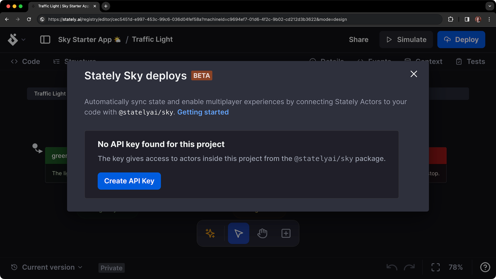
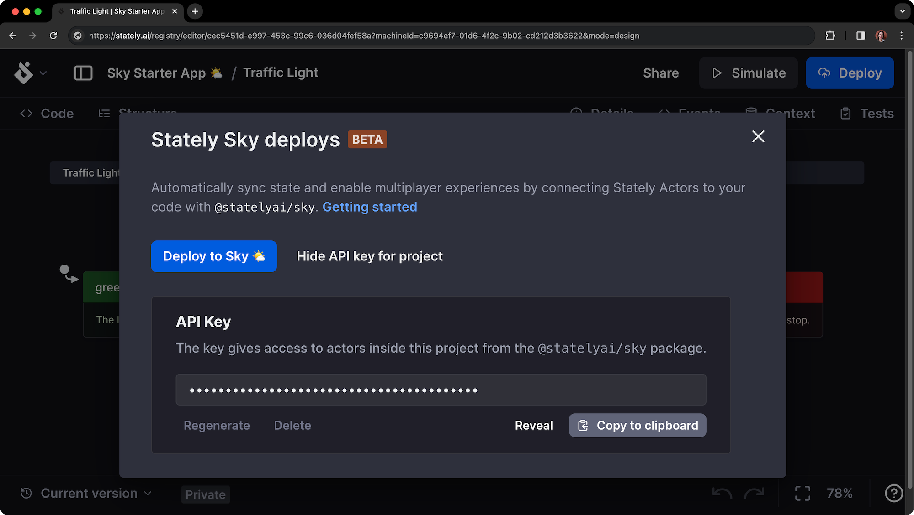
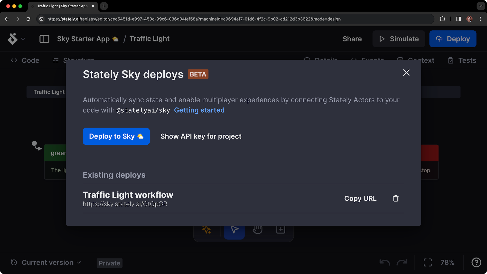
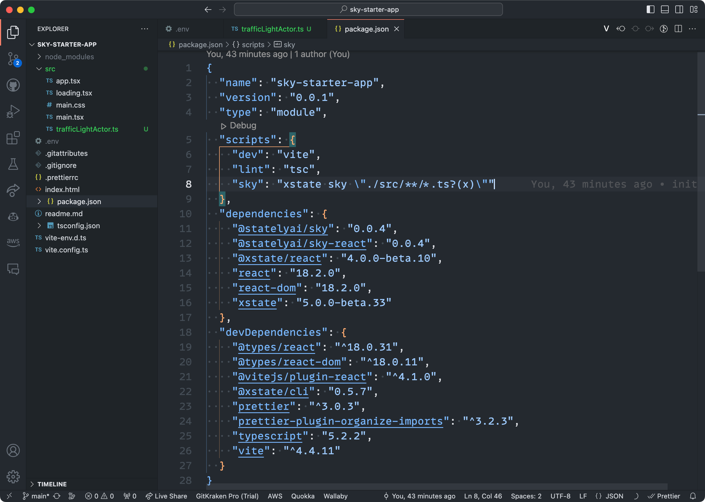

# Stately Sky 入门指南 🌤️

本指南将引导您使用 [XState](/docs/xstate.mdx)、[Vite](https://vitejs.dev/) 和 [React](https://reactjs.org/) 部署一个简单的交通灯状态机工作流。

:::warning

请注意，Sky 目前处于测试阶段，变化较快。

:::

## 您需要准备的

- 一个 [Stately](https://stately.ai) 账户，并拥有 [Pro、团队或企业订阅](https://stately.ai/pricing)。
- 我们的 [Stately Sky 入门项目](https://github.com/statelyai/sky-starter-app)。将仓库克隆到您的本地机器。

:::studio

我们的高级用户在测试阶段可以无限制使用 Stately Sky。您可以通过免费试用体验 Stately Studio 的高级计划。[查看我们的 Pro 计划功能](studio-pro-plan.mdx)、[团队计划](studio-team-plan.mdx)、[企业计划](studio-enterprise-plan.mdx) 或 [升级您的现有计划](https://stately.ai/registry/billing)。

:::

## 入门视频

<YouTube id="JJHC0UyGsrQ" />

## 第一步：使用 Stately 创建一个状态机

在 [Stately 编辑器](https://stately.ai/editor) 中创建一个项目并编写您想要的状态和转换。

在这个示例中，我们将创建一个简单的交通灯状态机，包含三个状态：`green`、`yellow` 和 `red`。您可以分叉 [我们的交通灯示例](https://stately.ai/registry/editor/eb3e89f5-5936-439f-8254-2f6ea4303659?machineId=15fd8071-b80c-4a6f-b9f5-60b6cf578ee5) 进行测试。查看 [这个交通灯状态机的部署版本](https://sky-starter.stately.ai/?page=trafficlight)。

<EmbedMachine
  embedURL="https://stately.ai/registry/editor/embed/eb3e89f5-5936-439f-8254-2f6ea4303659?machineId=15fd8071-b80c-4a6f-b9f5-60b6cf578ee5"
  name="Traffic light"
/>

:::xstate
Sky 仅支持 [XState](https://github.com/statelyai/xstate) V5 状态机。[XState V5 的变化](/docs/migration.mdx) 提供了更好的开发者体验，并更贴近 [Actor 模型](/docs/actor-model.mdx)，使 Sky 能够可靠地部署能够有效通信其状态的状态机。
:::

:::typescript

**XState v5 需要 TypeScript 版本 5.0 或更高版本。**

为了获得最佳效果，请使用最新的 TypeScript 版本。[阅读更多关于 XState 和 TypeScript 的信息](typescript.mdx)

:::

## 第二步：创建 API 密钥

创建状态机后，您需要创建一个 API 密钥以将其部署到 Sky。

1. 使用编辑器右上角的 **Deploy** 按钮打开 Stately Sky 选项。
2. 使用 **Create API Key** 按钮生成一个 API 密钥。



3. 确保复制该 API 密钥并将其安全保存。您稍后会需要它。

页面应如下所示：



## 第三步：将状态机部署到 Sky

生成 API 密钥后，您可以将状态机作为工作流部署到 Sky。

1. 使用 **Deploy to Sky 🌤️** 按钮开始部署过程。
2. 当工作流部署完成后，它将列在 **Existing deploys** 下。
3. 使用 **Copy URL** 将 URL 复制到剪贴板。

您需要引用启动项目中的工作流 URL。



## 第四步：在启动项目中添加 actor

添加 API 密钥后，您需要创建一个 actor。

1. 在启动项目的 `src` 目录中创建一个新文件。我们将其命名为 `trafficLightActor.ts`。
2. 在新文件中，导入 `actorFromStately` 函数，并使用提供的 URL 和您自己的会话 ID 初始化 actor：

```typescript
import { actorFromStately } from '@statelyai/sky';

const actor = actorFromStately({
  apiKey: '在此粘贴您的 API 密钥',
  url: '在此粘贴您的 Sky URL',
  sessionId: '您的会话 ID',
});
```

:::tip
默认情况下，Sky 是多人模式。
会话 ID 用于分片多人会话。每个 actor 都有一个唯一的会话 ID。

- 使用共享的会话 ID 允许多个用户引用同一个 actor。
- 如果您希望用户隔离，请为每个用户使用唯一的会话 ID。

:::

## 第五步：从 Sky 获取配置

现在我们已经创建了 actor，我们需要从 Sky 获取配置。这样做将下载并生成我们的仓库中的状态机配置文件，使我们在与运行的 actor 交互时具有类型安全性！

要获取配置，我们将使用 [XState CLI 工具](/docs/developer-tools.mdx#xstate-cli-command-line-interface) 和 `package.json` 中已有的 `sky` 脚本。此脚本在 `src` 目录中的所有文件上运行命令，以查找与任何已初始化的 actor 关联的配置。



1. 使用您选择的包管理器运行 `sky` 命令：

```bash npm2yarn
npm run sky
```

2. 一旦 `sky` 命令完成，您应该会看到：

- 一个带有更新导入的第二个 `skyConfig` 参数传递给 `actorFromStately` 函数。
- 在您的 `src` 目录中，一个新的 TypeScript 文件，以 Studio 中的 actor 命名。在我们的例子中，它是 `trafficLightActor.sky.ts`。

您会在 `sky.ts` 文件中看到一个警告，提示该文件是生成的。您不应手动编辑这些文件，因为任何本地更改都不会反映在 Sky 中运行的内容。

运行 `xstate sky` 只会影响尚未获取的文件。如果您在 Studio 中对状态机进行了更改，您需要删除生成的文件 `yourFile.sky.ts` 并再次运行命令。或者，您可以通过运行 `xstate sky --refetch` 强制重新获取。

:::tip

将生成的 `sky.ts` 文件添加到源代码管理中。

:::

## 完成

就是这样！您现在可以像与本地 actor 一样与运行的 actor 交互，例如使用 `send()` 函数发送事件。Sky 仍处于早期阶段，因此有一些限制和需要记住的事项。具体来说：

- 仅支持 XState V5 状态机。
- 如果您使用的是 React Native，请参阅 [此评论](https://github.com/statelyai/sky/issues/6#issuecomment-1766967479) 以解决问题。